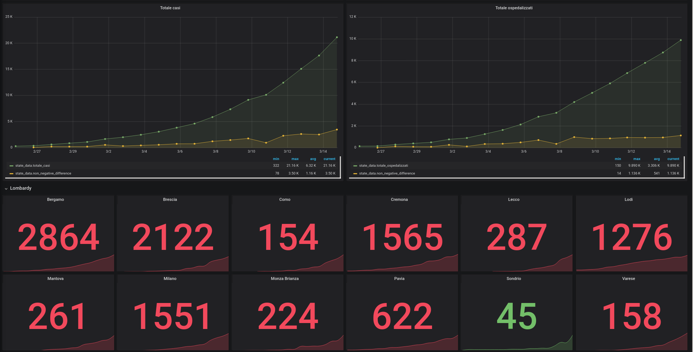
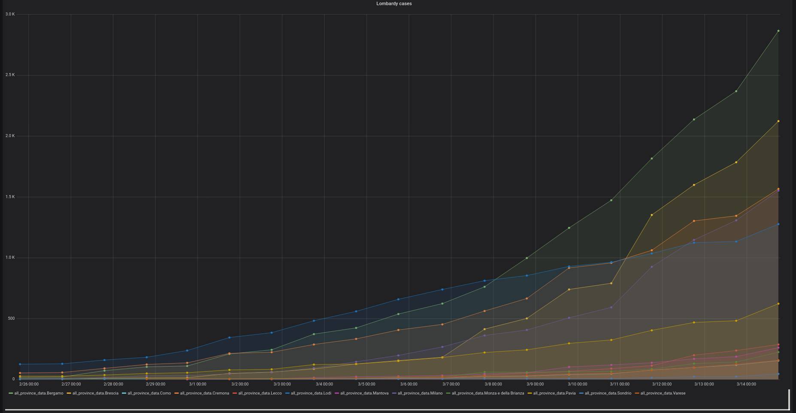

# COVID-19_graphs

Analyze the cases related to the COVID19 in Italy.

## Demo

A running public instance is available at:

https://covid19.hackx.com/d/OO1TC7XZk/covid-19-cases?orgId=1

## Usage

This repository provides a InfluxDB + Grafana environment in order to track the evolution of the number of COVID19 cases.

In order to raise up the environment:

```bash
docker-compose up
``` 

Than, you can access to the Grafana page at the following link:  

http://10.5.0.5:3000/dashboards

Using the following credentials:
 - username: admin
 - password: admin
 
 
 ## Preview
 
 
 
 
 
 
 ## Dataset
 
 The data are retrieved from the following repo:
 
 https://github.com/pcm-dpc/COVID-19
